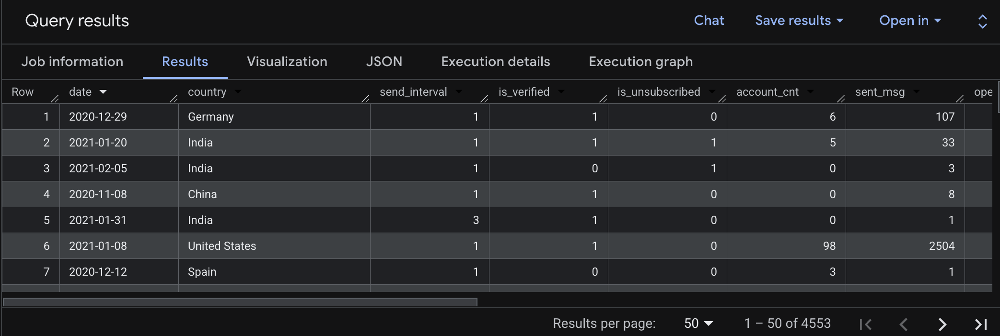
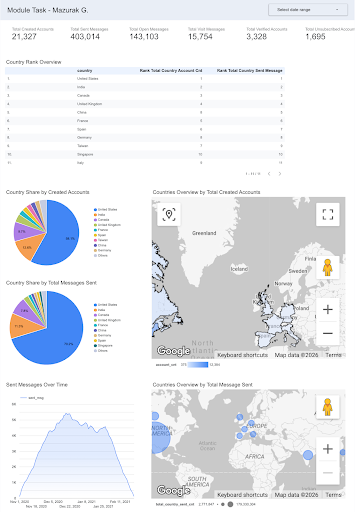

## Project Overview
The goal of this project is to analyze account creation dynamics and user engagement with email marketing. By merging account data with communication metrics, this dataset enables performance tracking across key markets, user segments, and subscription statuses.

## Objectives
- Performance Tracking: Analyze account growth and email activity (sends, opens, clicks) over time.
- Market Segmentation: Compare user behavior across different countries and identify top-performing regions.
- Engagement Analysis: Evaluate how verification status and send intervals impact user retention and interaction.

## Technical Requirements
- SQL (BigQuery): A single comprehensive query using CTEs and Window Functions to aggregate metrics.
- Unified Data Model: Leverages UNION ALL to combine account and email events while maintaining distinct date logic for each.
- Window Functions: Used to calculate global totals and rank countries based on volume.
- Top 10 Filter: The final dataset is limited to the top 10 countries by account volume or email activity.
- Visualization: An interactive dashboard created in Looker Studio to visualize the processed data.

## Result:

## Looker Dashboard:

