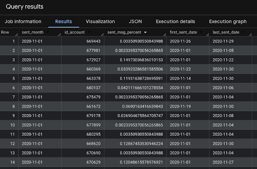

In this task, I did the following:
- Calculate the percentage of emails sent to each account within each month, relative to the total number of emails sent to all accounts that month (number of emails sent to the account during the month / total number of emails sent in that month).
- Determine the first and last email sent date for each account within each month.
- All calculations must be done using window functions without using Group by.

Result:

